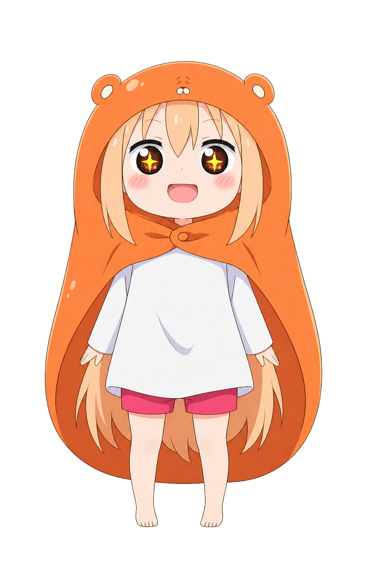

# 角色动作表情分镜 Skill 教学（V1.0）

这个 Skill 会把一张动画角色图片或真人照片制作成透明背景的 Q 版动作与表情分镜。

- 动画图片：抠出主角，保留原本造型，再生成不同动作与表情。
- 真人照片：先抠出人物并制作成 Q 版角色，再生成不同动作与表情。
- 所有正式成果必须是带 Alpha 通道的**透明背景 PNG**。

## 完整创作目录不会被浓缩

V1.0 保留 [30 种姿势](./Skill/character-storyboard-generator/references/poses.json)和 [40 种表情](./Skill/character-storyboard-generator/references/expressions.json)。资料夹简化只影响查找方式，不会删除站立、立正、盘坐、正坐、懒趴、躺着、五体投地、挥手等动作，也不会删除喜、怒、哀、乐、震惊、惊吓、委屈、哭泣、无语、古灵精怪等表情。

动作与表情可以完整交叉组合。小埋属于未成年角色，因此 30 个“性感”组合被安全停用，其余仍保留 1,170 个可生成组合。

## 项目结构

```text
项目根目录/
├─ README.md
├─ 教学.md
├─ Skill/
│  └─ character-storyboard-generator/
└─ Sample/
   ├─ 原图.png
   └─ 成果/
      ├─ 喜-开心/
      ├─ 怒-愤怒/
      ├─ 哀-哭泣/
      └─ 静-平静/
```

使用者在 `Sample` 中只需要看原图与成果。成果资料夹只用一层“情绪-表情”分类；动作放在文件名中。同一种表情的所有站姿、坐姿、趴姿和手势都会放在一起。

## 使用方法

1. 准备一张人物清楚、遮挡较少的图片。
2. 告诉 Codex：`使用 $character-storyboard-generator，把这张图制作成透明背景的动作表情分镜。`
3. Skill 会判断输入是动画还是真人照片。
4. 先生成少量校准图，确认脸型、发型、服装、颜色和 Q 版比例一致。
5. 再按需要生成完整动作 × 表情组合。
6. 最后检查透明通道、人物完整度、命名与资料夹位置。

## 未成年人保护

未成年人、看起来年幼的角色，以及年龄无法确认的人物，一律启用保护：

- 禁止性感、诱惑、成人化恋爱或恋物化表现。
- 禁止暴露服装、身体部位强化、挑逗视角与暗示性姿势。
- “迷人”只能解释为亲切、自信或闪亮可爱；“性感”组合直接停用。
- 趴着、躺着、哭泣等动作只能表现为日常、休息或搞笑情境。

## 固定命名

```text
角色__动作ID-动作__表情ID-表情__版本序号__v1.0.png
```

例如：

```text
xiaomai__P06-wave-goodbye__E01-joy__v01__v1.0.png
```

## 透明背景要求

- PNG 必须含 Alpha 透明通道。
- 图片四角必须是透明像素。
- 人物边缘不可残留绿色、白色或黑色毛边。
- 不可出现背景、地板、阴影、文字、水印或对话框。
- 头发、手、脚和贴地轮廓不可被裁切。

某些软件会以黑色、白色或棋盘格显示透明区域；这只是预览方式，并非图片带有背景。

## 当前实际范例

目前 Sample 包含 **31 张透明背景 PNG**，其中自然站立已经制作 18 种表情：开心、愤怒、哀伤、开怀大笑、震惊、惊吓、委屈、哭泣、生气带笑、强忍笑意、古灵精怪、嫌弃、面无表情、无语、面无表情地生气、疑惑、坚定、星星眼期待。

### 站立：开心


### 站立：愤怒


### 站立：哀伤


### 站立：震惊


### 站立：面无表情地生气


### 站立：星星眼期待



### 正坐：平静


### 懒趴：无语


### 五体投地：哭泣


完整范例请直接浏览 [`Sample/成果`](./Sample/成果)。
